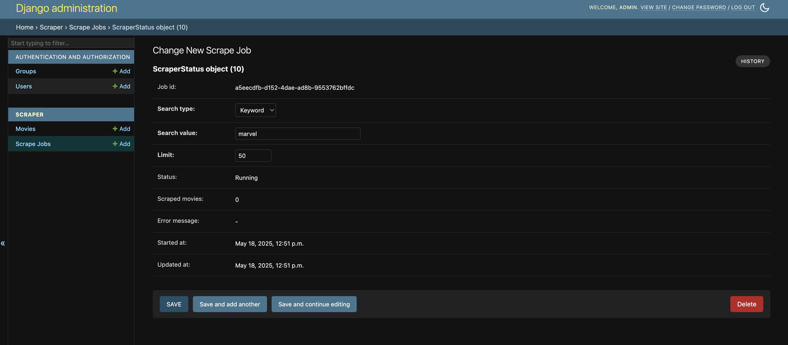
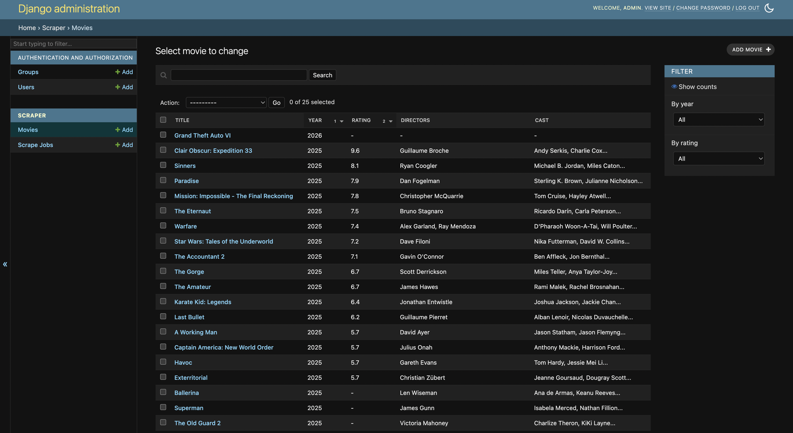

# 🎬 IMDb Scraper Project (Django + Admin + API)

This Django project allows you to scrape movie data from IMDb based on `genre` or `keyword`, and manage everything via the Django Admin interface or REST API.

---

## ⚙️ Setup Instructions

### 1. 🔁 Clone the Repository

```bash
git clone https://github.com/dilip1232/imdb-scraper.git
cd imdb-scraper
```

### 2. 📦 Install Requirements

```bash
pip install -r requirements.txt
```

> Ensure you have Python 3.9+ installed. Playwright setup is required for scraping:
>
```bash
playwright install
```

### 3. 🧱 Set Up the Database

```bash
python manage.py makemigrations
python manage.py migrate
```

### 4. 🧪 Run Tests (optional)

```bash
python manage.py test
```

### 5. 🧑‍💻 Create Superuser

```bash
python manage.py createsuperuser
```

### 6. 🚀 Run the Server

```bash
python manage.py runserver
```

---

## 🛠 Start a Scraper Job (via Admin Panel)

You can trigger and monitor scrapers directly from Django Admin:

1. Go to [http://localhost:8000/admin/](http://localhost:8000/admin/)
2. Navigate to **"Scrape Jobs"**
3. Click **"Add New Scrape Job"**
4. Set `search_type`, `search_value` (e.g. "action", "thriller"), and a `limit`
5. Hit **Save** — the scraper runs automatically, status will update

### 🖼️ Admin Scraper Control Panel



---

## 🎞️ Browse Scraped Movies

From Django Admin, go to the **Movies** section to see all scraped results.



---

## 📡 API: Access Scraped Movies

### 📥 Endpoint

```
GET /scraper/movies/
```

### 🔎 Query Parameters

| Param       | Type   | Description                               |
|-------------|--------|-------------------------------------------|
| `search`    | string | Search in title, cast, plot, directors    |
| `year`      | int    | Filter by release year                    |
| `rating`    | float  | Filter by exact rating                    |
| `ordering`  | string | Order by field (`-rating`, `year`, etc.) |
| `per_page`  | int    | Items per page                            |

### 📤 Sample Request

```
GET /scraper/movies/?search=action&year=2023&ordering=-rating&per_page=5
```

### 📥 Sample Response

```json
{
  "count": 120,
  "next": "http://localhost:8000/api/movies/?page=2",
  "previous": null,
  "results": [
    {
      "title": "The Action Hero",
      "year": 2023,
      "rating": 8.2,
      "directors": "John Smith",
      "cast": "Jane Doe, Alan Walker",
      "plot": "A thrilling journey of a rogue agent."
    }
  ]
}
```

---

## 📂 Project Structure

```bash
scraper/
├── models.py             # Movie and ScraperStatus models
├── admin.py              # Admin panel + trigger logic
├── views.py              # DRF API + admin integrations
├── serializers.py        # Movie API serializer
├── urls.py               # API and admin URLs
├── management/
│   └── commands/
│       └── scraper.py    # Core scraper logic using Playwright
├── tests.py              # API + scraper unit tests
```

---

## ✅ Technologies Used

- Django + Django Admin
- Django REST Framework
- Playwright (async web scraping)
- BeautifulSoup (HTML parsing)
- PostgreSQL / SQLite
- DRF Filtering, Ordering, Pagination
- Threading + Async

---

## 🚀 Future Improvements

- 🔁 **API-based scraper trigger**
- 📈 **Real-time admin scraper status** (WebSocket or polling)
- 🎛️ **Advanced filtering**:
  - Range support (e.g., `rating__gte=6`)
  - Multi-field sorting
- 🧠 **Intelligent deduplication + movie merging**
- ⏰ **Scheduled scrapes** using Celery Beat
- 🌍 **Frontend dashboard** (HTMX / React)